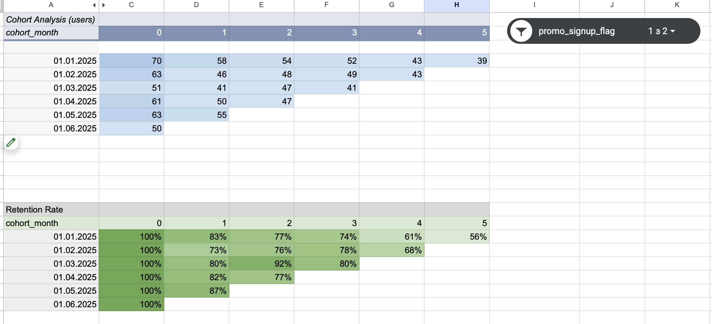
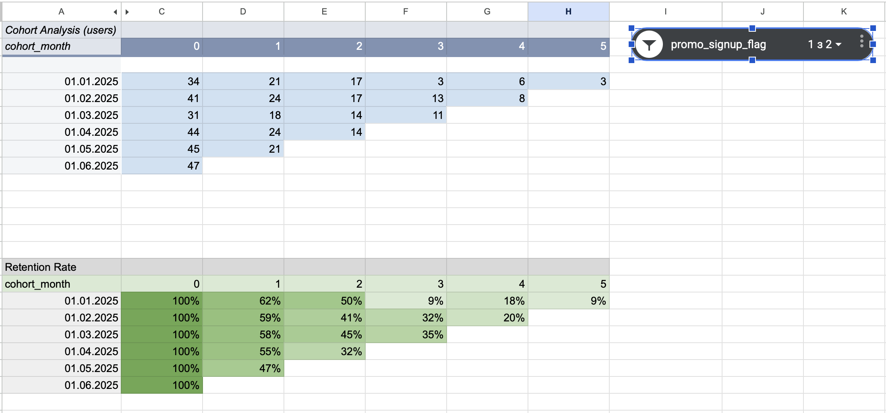

# User Cohort Analysis

## Overview

This project analyzes user retention using cohort analysis techniques in SQL and Google Sheets.

The objective was to compare retention rates between users acquired through promotional campaigns and organically acquired users, identify retention patterns, and provide business recommendations based on the findings.

---

## Project Tasks

* Clean and standardize date fields with inconsistent formats
* Join user and event datasets
* Build user cohorts based on signup month
* Calculate monthly retention metrics
* Create cohort tables and retention matrices
* Compare retention performance between promotional and organic users
* Develop business recommendations based on retention trends

---

## Tools Used

* SQL (PostgreSQL)
* Google Sheets
* Cohort Analysis
* Retention Analysis
* Pivot Tables
* Conditional Formatting
* Slicers

---

## Dataset

The analysis was based on two source tables:

### cohort_users_raw

Contains user registration information:

* user_id
* signup_datetime
* promo_signup_flag

### cohort_events_raw

Contains user activity information:

* user_id
* event_datetime
* event_type

---

## SQL Analysis

The SQL script performs:

* Date cleaning and normalization
* User-event data joining
* Cohort month calculation
* Month offset calculation
* Retention data preparation
* User aggregation by cohort and activity month

Main file:

* `cohort_analysis.sql`

---

## Google Sheets Dashboard

The cohort analysis was visualized in Google Sheets using:

* Pivot tables
* Retention rate calculations
* Conditional formatting
* Interactive slicer for user segmentation

### Organic Users Retention

### Promotional Users Retention

---

## Key Findings

* Promotional users showed significantly lower retention rates compared to organically acquired users.
* The largest drop in retention occurred after the first month.
* Organic users maintained retention rates of approximately 75–85% during the early lifecycle stages.
* Promotional users demonstrated substantially higher churn and lower long-term engagement.
* Organic cohorts showed more stable behavior and slower retention decline, indicating higher acquisition quality.

---

## Recommendations

1. Review promotional acquisition channels, as current campaigns attract users with lower retention rates.
2. Improve the onboarding experience, since the highest user drop-off occurs during the first month.
3. Introduce retention initiatives for promotional users, such as reminders, personalized offers, and re-engagement campaigns.
4. Monitor retention performance separately for promotional and organic cohorts to optimize acquisition strategy.

---

## Author

**Taisiia Petrovska**
